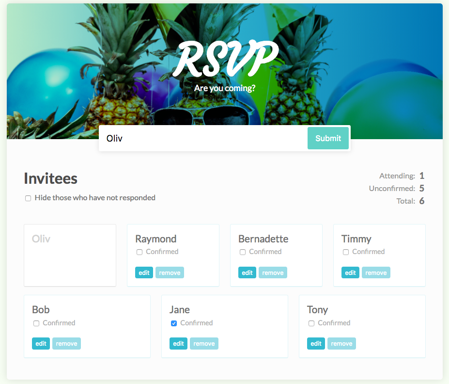

# RSVP React App

This is a React app designed for users to RSVP to an event. It is, at this stage, only the frontend component - data is not saved.

Users can add guests, edit guest names, remove guests, and mark guests as confirmed or unconfirmed. The counters on the right of the screen update accordingly. A new guest tile with ghost text appears while a name is being typed into the Invite field.

This was completed based on the Treehouse tutorial [React by Example](https://teamtreehouse.com/library/react-by-example).
